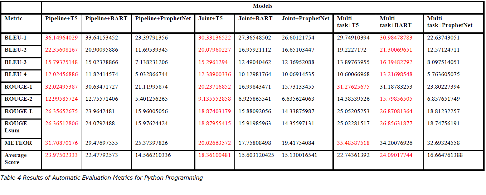
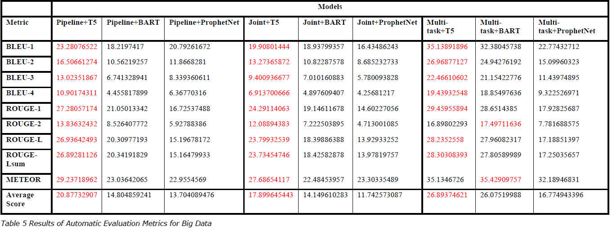
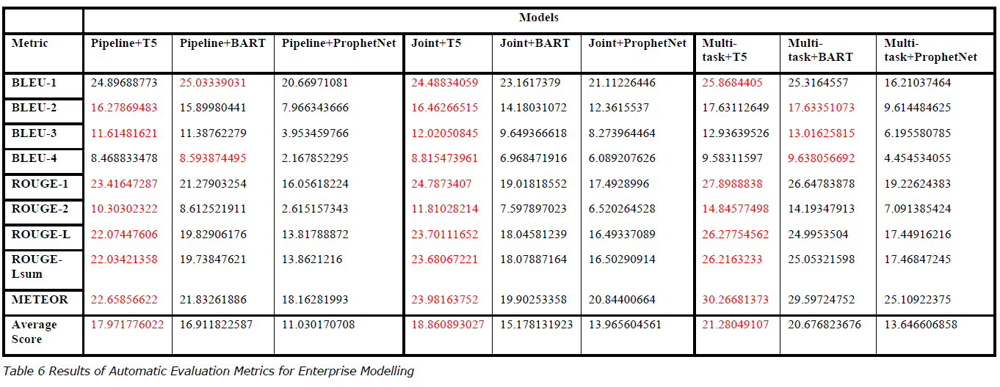
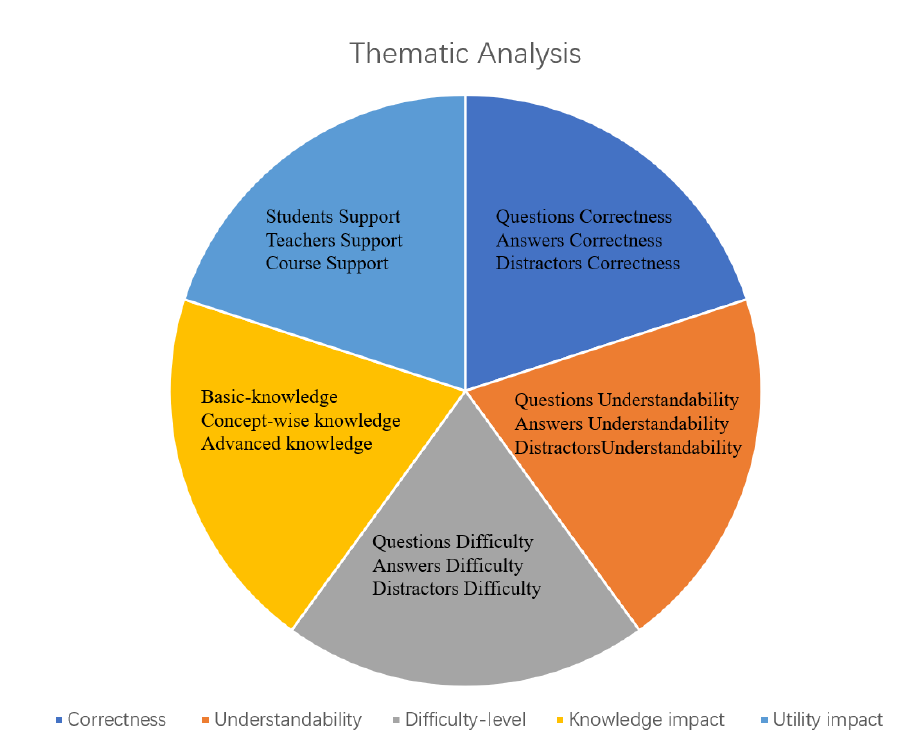
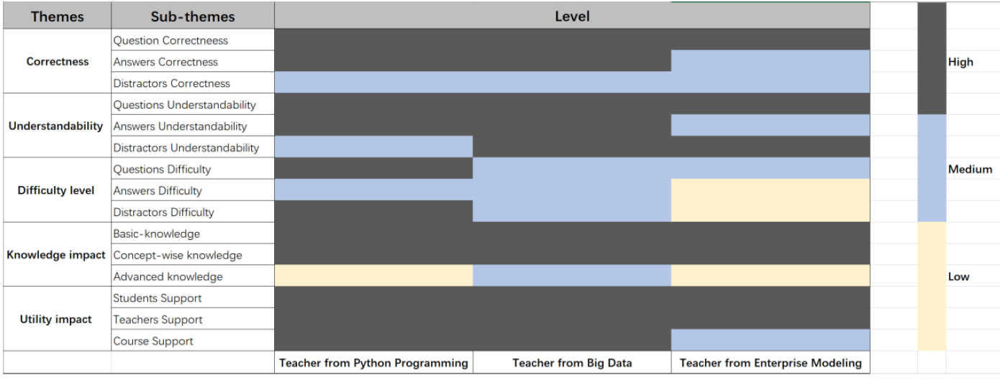

Automatic question-answer pairs generation using NLP pre-trained language models
==
How do they perform for educational purposes?
--

## 1. Introduction
Three different approaches were implemented and fine-tuned on the **SQuAD dataset** to generate QA pairs: 
* Multi-task
* Pipeline
* Joint model 

The **distractors** are essential for multi-choice questions, one **T5-based distractor generation model** is fine-tuned with the **DG-RACE dataset**. 

The **evaluation** stage includes two separate methods: 
* automatic evaluation: the metrics for the text generation models are employed, including **BLEU, METEOR, and ROUGE**.
* expert evaluation: involved semi-structured interview to carry out the qualitative analysis.

## 2. The structure of the code files
```
│  convert_to_json.py       # Convert the benchmark data into json format
│  data_loader.py	    # Load data
│  test_model.py            # Fine-tuned model testing, just for development
│  trainer.py	            # Trainer for all tasks
│  utils.py	            # Independent functions, including automatic evaluation metrics
│  
├─benchmark_dataset         # The folder to put benchmark dataset.
│
├─benchmark_qa		    # The folder to put the generated QA from benchmark dataset
├─distractor		    # Distrsctor generation model and datasets
│  │  data_processor.py     # Data preprocessing of distractor generation
│  │  model.py		    # Dsitractor generation model
│  │  trainer.py	    # The training functions of the distractor model
│  │  
│  ├─dataset		    # The dataset for distractor generation, Recommend to use updated dataset.
│  │      
│          
├─joint	
│  │  data_processor.py     # The data preprocessing for joint model
│  │  model.py              # Definition of the joint model
│  │  trainer.py            # The training functions of the joint model
│  │  
│          
├─multitask
│  │  data_processor.py     # The data preprocessing for multi-task model
│  │  model.py              # Definition of the multi-task model
│  │  trainer.py            # The training functions of the multi-task model
│  │  
│          
├─pipeline
│  │  data_processor.py     # The data preprocessing for pipeline model
│  │  model.py              # Definition of the pipeline model
│  │  trainer.py            # The training functions of the pipeline model
│  │  
│          
├─processed_squad           # The preprocessed SQuAD dataset will be saved here
├─saved_models              # The folder to save the fine-tuned models
```

## 3. Code running
In **trainer.py**
* **Training task config**
```
    def __init__(self):
        self.task_names = {
            'multitask': MultitaskTrainer,
            'qgtask': AGQGTrainer,
            'agtask': AGQGTrainer,
            'dgtask': DGTrainer,
            'qgkgtask': QGKGTrainer,
            'j_agtask': AGTrainer
        }
```

* **Training parameter setting**
```
    def _prepare_train(self, task_name, lm_type, lm_name):
        self.lm = self.lms.get(lm_type)
        self.generative_lm = self.generative_lms.get(lm_type)
        self.lm_name = lm_name
        self.tokenizer = self.tokenizers.get(lm_type)

        task_config = {
            'lm': self.lm,
            'generative_lm': self.generative_lm,
            'lm_name': self.lm_name,
            'tokenizer': self.tokenizer,
            'lambda_p': 0,
            'batch_size': 12,
            'epochs': 5,
            'lr': 1e-5,
            'vocab_size': 50265,
            'embed_dim': 768,
            'num_heads': 12,
            'dataset': 'processed_squad',
            'max_encoder_len': 128,
            'max_decoder_len': 64,
            'saved_model': None,
        }
        if task_name == 'qgtask':
            task_config['generation_task'] = 'question'
        else:
            task_config['generation_task'] = 'answer'
        return task_config
```

* **Training task and language models**
```
if __name__ == "__main__":
    trainer = Trainer()
    # training config
    trainer.train(TASK_NAME, LANGUAGE_MODEL_TYPE, LANGUGE_MODEL_NAME)
    # valudating config
    trainer.validate(TASK_NAME, LANGUAGE_MODEL_TYPE, LANGUAGE_MODEL_NAME)
```

* **Inference**
```
if __name__ == "__main__":
    trainer = Trainer()
    trainer.test_pipeline(lm_type=LANGUAGE_MODEL_TYPE,
                          lm_name=LANGUGE_MODEL_NAME,
                          saved_qg_model=SAVED_QG_MODEL,
                          saved_ag_model=SAVED_AG_MODEL,
                          dg_lm_type=LANGUAGE_MODEL_TYPE,
                          dg_lm_name=LANGUAGE_MODEL_NAME,
                          saved_dg_model=SAVED_DG_MODEL,
                          max_encoder_len=MAX_ENCODER_LEN,
                          max_decoder_len=MAX_DECODER_LEN)

```

## 4. Results
### 4.1 Automatic Evaluation






### 4.2 Expert Evaluation




****
### *Author Information*
Author: Jintao Ling, EMAIL ME: *lingjintao.su@gmail.com* <br />
Supervisor: Muhammad Afzaal, GitHub: [HERE](https://github.com/muhammadafzaal) <br />
Organization: Stockholm University